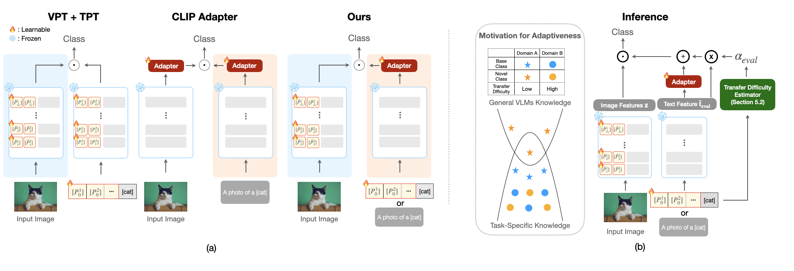

# APEX: text ***A***dapter, visual ***P***rompt, and adaptive ***E***nsemble for cross(***X***)-modality

> [**Improving Adaptability and Generalizability of Efficient Transfer Learning for Vision-Language Models**](https://arxiv.org/pdf/2311.15569.pdf)<br>


[](https://arxiv.org/pdf/2311.15569.pdf)


Official implementation of the paper "[Improving Adaptability and Generalizability of Efficient Transfer Learning for Vision-Language Models](https://arxiv.org/pdf/2311.15569.pdf)".
<hr />


## Highlights


> **<p align="justify"> Abstract:** *Vision-Language Models (VLMs) like CLIP have demonstrated remarkable applicability across a variety of downstream tasks, including zero-shot image classification. Recently, the use of prompts or adapters for efficient transfer learning has gained significant attention for effectively adapting to downstream tasks. However, the roles of vision and text prompts, as well as adapters in terms of generalization and transfer difficulty, have been overlooked, limiting performance on unseen tasks. In this paper, we empirically analyze how VLMs behave when using vision and text prompts, adapters, and a combination of these components, marking a novel exploration by our study. Our observations find that utilizing vision prompts for class separability and text adapters for task adaptation is crucial for adaptability and generalizability. Moreover, to improve generalization across every domain, we propose an adaptive ensemble method that effectively combines the general knowledge of VLMs with task-specific knowledge according to transfer difficulty. Upon experimenting with extensive benchmarks, our method consistently outperforms all baselines, particularly on unseen tasks, demonstrating the effectiveness of our proposed approach.* </p>


## :ballot_box_with_check: Supported Methods

[comment]: <> (| Language Prompting            | MaPLe |  [link]&#40;configs/trainers/IVLP/vit_b16_c2_ep5_batch4_4ctx_language_only.yaml&#41;      |      |)

| Method                    | Paper                                         |                             Configs                             |          Training Scripts          |
|---------------------------|:----------------------------------------------|:---------------------------------------------------------------:|:----------------------------------:|
| APEX | [preprint](https://arxiv.org/pdf/2311.15569.pdf) | [link](configs/trainers/APEX/vit_b16_c2_ep15_batch16_2+2ctx.yaml)  |       [link](scripts/apex)
| MaPLe                     | [CVPR 2023](https://arxiv.org/abs/2210.03117)                                     | [link](configs/trainers/MaPLe/vit_b16_c2_ep5_batch4_2ctx.yaml)  |       [link](scripts/maple)        |
| CoOp                      | [IJCV 2022](https://arxiv.org/abs/2109.01134) |                  [link](configs/trainers/CoOp)                  |        [link](scripts/coop)        |
| Co-CoOp                   | [CVPR 2022](https://arxiv.org/abs/2203.05557) |                 [link](configs/trainers/CoCoOp)                 |       [link](scripts/cocoop)       |
| Deep Vision Prompting     | -                                             |    [link](configs/trainers/VPT/vit_b16_c2_ep5_batch4_4.yaml)    |        [link](scripts/vpt)         |
| Deep Language Prompting   | -                                             |                 [link](configs/trainers/IVLP/vit_b16_c2_ep5_batch4_4ctx_language_only.yaml)                  | [link](scripts/language-prompting) |
| Independent V-L Prompting | -                                             | [link](configs/trainers/IVLP/vit_b16_c2_ep5_batch4_2+2ctx.yaml) |  [link](scripts/independent-vlp)   |

<hr />


## Results
### MaPLe in comparison with existing methods
The results reported below show the accuracy for both base and novel classes across 11 recognition datasets. These results are averaged over 20 seeds and have been reproduced by us.

| Name                                                      | Base Acc. | Novel Acc. |    HM     | Epochs | 
|-----------------------------------------------------------|:---------:|:----------:|:---------:|:------:|
| [CLIP](https://arxiv.org/abs/2103.00020)                  |   69.34   |   74.22    |   71.70   |   -    |  
| [CLIP-Adapter](https://arxiv.org/abs/2110.04544)                  | 83.23 |   70.13    |   75.64  |  50   | 
| [CoCoOp](https://arxiv.org/abs/2203.05557) |   81.11   |   70.55  |   75.03   |   10   | 
| [MaPLe](https://arxiv.org/abs/2210.03117)  |   82.52   | 74.24  | 77.86 |   5    |
| [PromptSRC](https://arxiv.org/abs/2307.06948)  |   **84.36**   | 75.37  | 79.39 |   20    |
| [APEX (ours)](https://arxiv.org/pdf/2311.15569.pdf)  |  83.99  | **76.76**  | **80.04** |   15    |


## Installation 
For installation and other package requirements, please follow the instructions detailed in [INSTALL.md](docs/INSTALL.md). 

## Data preparation
Please follow the instructions at [DATASETS.md](docs/DATASETS.md) to prepare all datasets.


## Training and Evaluation
Please refer to the [RUN.md](docs/RUN.md) for detailed instructions on training, evaluating and reproducing the results using our pre-trained models.

<hr />

## Citation
If you use our work, please consider citing:
```bibtex
@article{yang2023improving,
  title={Improving Adaptability and Generalizability of Efficient Transfer Learning for Vision-Language Models},
  author={Yang, Yongjin and Ko, Jongwoo and Yun, Se-Young},
  journal={arXiv preprint arXiv:2311.15569},
  year={2023}
}
```

## Acknowledgements
Our code is based on [Co-CoOp and CoOp](https://github.com/KaiyangZhou/CoOp) repository and [MaPLe](https://github.com/muzairkhattak/multimodal-prompt-learning) repository. We thank the authors for releasing their code. If you use our model and code, please consider citing these works as well.


